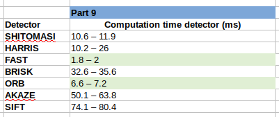

Sensor Fusion Nanodegree - 2D Feature Tracking Project
======================================================

In this document we summarize the work done for the 2D Feature Tracking Project,
specifying how the different points in the rubric are fulfilled.


MP.0 Mid-Term Report
--------------------

```
Provide a Writeup / README that includes all the rubric points and how you addressed each one.
You can submit your writeup as markdown or pdf.
```

This document is addressing the rubric points as requested.

MP.1 Data Buffer Optimization
-----------------------------
```
Implement a vector for dataBuffer objects whose size does not exceed a limit (e.g. 2 elements).
This can be achieved by pushing in new elements on one end and removing elements on the other end.
```

This is implemented in `MidTermProject_Camera_Student.cpp` as follows:

```cpp
//// STUDENT ASSIGNMENT
//// TASK MP.1 -> replace the following code with ring buffer of size dataBufferSize
DataFrame frame{};
frame.cameraImg = imgGray;

if (dataBuffer.size() < dataBufferSize)  // If the buffer is not yet full, simply push back
{
    dataBuffer.push_back(frame);
}
else  // Otherwise shift data and place new frame in the back
{
    // Shift contents in ring buffer
    for (std::size_t i = 1U; i < dataBuffer.size(); ++i)
    {
        dataBuffer[i - 1U] = dataBuffer[i];
    }

    // Add new image to the back
    dataBuffer.back() = frame;
}

//// EOF STUDENT ASSIGNMENT

```

Basically, `push_back` into the buffer until it's full, and then shift
the data to the left and put the new data on the `back()`.

MP.2 Keypoint Detection
-----------------------
```
Implement detectors HARRIS, FAST, BRISK, ORB, AKAZE, and SIFT and make them
selectable by setting a string accordingly.
```

This is implemented in `matching2D_Student.cpp` in the functions `detKeypointsHarris`
and `detKeypointsModern`.

**Note:** the selection is not done via a `string`, but rather an
`enum class DetectorType` has been defined for a more strong typing. It also
gives a better overview to the user as to what detectors are available.

All the detectors are based on the OpenCV implementation, default constructed.


MP.3 Keypoint Removal
---------------------
```
Remove all keypoints outside of a pre-defined rectangle and only use the
keypoints within the rectangle for further processing.
```

This is implemented in `MidTermProject_Camera_Student.cpp` as follows:

```cpp
//// STUDENT ASSIGNMENT
//// TASK MP.3 -> only keep keypoints on the preceding vehicle

// only keep keypoints on the preceding vehicle
bool bFocusOnVehicle = true;
cv::Rect vehicleRect(535, 180, 180, 150);
std::vector<cv::KeyPoint> filtered_keypoints;
if (bFocusOnVehicle)
{
    for (const cv::KeyPoint& keypoint : keypoints)
    {
        if (vehicleRect.contains(keypoint.pt))
        {
            filtered_keypoints.push_back(keypoint);
        }
    }
}

keypoints = filtered_keypoints;
```

MP.4 Keypoint Descriptors
-------------------------
```
Implement descriptors BRIEF, ORB, FREAK, AKAZE and SIFT and make them
selectable by setting a string accordingly.
```

This is implemented in `matching2D_Student.cpp`, in the function
`descKeypoints`.

As before, an `enum class DescriptorType` has been defined to select
which one to use, instead of a `string`.

MP.5 Descriptor Matching
------------------------
```
Implement FLANN matching as well as k-nearest neighbor selection.
Both methods must be selectable using the respective strings in the main function.
```

This is implemented in `matching2D_Student.cpp`, in the function
`matchDescriptors`:

```cpp
else if (matcherType == MatcherType::FLANN)
{
    // Convert binary descriptors to floating point due to a bug in current OpenCV implementation
    if (descSource.type() != CV_32F)
    {
        descSource.convertTo(descSource, CV_32F);
        descRef.convertTo(descRef, CV_32F);
    }

    matcher = cv::FlannBasedMatcher::create();
}
```

```cpp
else if (selectorType == SelectorType::KNN)
{
    // k nearest neighbors (k=2)
    std::vector<std::vector<cv::DMatch>> knn_matches;

    const int k = 2;
    matcher->knnMatch(descSource, descRef, knn_matches, k);
```

As before, corresponding enums `SelectorType` and `MatcherType` have
been created.

MP.6 Descriptor Distance Ratio
------------------------------
```
Use the K-Nearest-Neighbor matching to implement the descriptor distance ratio test,
which looks at the ratio of best vs. second-best match to decide whether to keep an
associated pair of keypoints.
```

This is implemented in `matching2D_Student.cpp`, in the function
`matchDescriptors`:

```cpp
// Compute distance ratio and only keep non-ambiguous matches
const float min_desc_dist_ratio = 0.8F;
for (const std::vector<cv::DMatch>& match_pair : knn_matches)
{
    const float distance_ratio = match_pair[0].distance / match_pair[1].distance;
    if (distance_ratio < min_desc_dist_ratio)
    {
        matches.push_back(match_pair[0]);
    }
}
```


MP.7 Performance Evaluation 1
-----------------------------
```
Count the number of keypoints on the preceding vehicle for all 10 images and take
note of the distribution of their neighborhood size. Do this for all the detectors
you have implemented.
```

For all detectors, the number of keypoints detected on the preceeding
vehicle has been counted, noted down in the spreadsheet `performance.ods`,`Part 7`, as shown in the picture below:


The numerical range represents the min and max value across the 10 images.

As can be seen, FAST and BRISK (highlighted in light green)
detect the largest number of keypoints,
whereas HARRIS detects the lowest number of points. All detectors
tend to detect points around the contour of the car, the headlights
and the license plate, as well as a few points on the road and other
cars, still within the "preceeding vehicle box". A better filtering
would help removing those detections.

The neighborhood size varies with the different descriptors.
For example Shi-Tomasi, Harris and FAST keypoints have a small
neighborhood, whereas ORB, AKAZE and SIFT have a medium to large
neighborhood size.


MP.8 Performance Evaluation 2
-----------------------------
```
Count the number of matched keypoints for all 10 images using all possible
combinations of detectors and descriptors. In the matching step, the BF approach is
used with the descriptor distance ratio set to 0.8.
```

As can be seen in `main.cpp`, we run all possible combinations
of detectors and descriptors and compute some performance indicators
as noted in the `performance.ods` spreadsheet.

**Note:** the following combinations could **not** be tested:

- AKAZE descriptor with a non-AKAZE detector. The OpenCV API
  documents that this is not possible.
- SIFT detector + ORB descriptor, due to out-of-memory errors.

These problems have been mentioned also on Udacity Hub.

The results on number of matched keypoints can be seen on `Part 8`
of the spreadsheet, as shown below:


The numerical range represents the min and max value across the 10 images.

As can be seen, the FAST detector in combination with any descriptor
(highlighted in light green) provides the largest amount of matches:
more than 200 in all cases, and reaching 300 for BRIEF and ORB descriptors.

The HARRIS and ORB detector give the lowest amount of matches.


MP.9 Performance Evaluation 3
-----------------------------
```
Log the time it takes for keypoint detection and descriptor extraction. The results
must be entered into a spreadsheet and based on this data, the TOP3 detector /
descriptor combinations must be recommended as the best choice for our purpose of
detecting keypoints on vehicles.
```

The computation times for the different parts of the algorithm
can be seen in the `performance.ods` spreadsheet, `Part 9`.

The numerical range represents the min and max value across the 10 images.

**Detector computation time (ms)**

The detector computation time (ms) is shown below:



The numerical range represents the min and max value across the 10 images.

We observe that FAST and ORB are the fastest detectors, with around
2 and 7 ms respectively. The slowest are AKAZE and SIFT.

**Descriptor computation time (ms)**

The descriptor computation time (ms) is shown below:


The numerical range represents the min and max value across the 10 images.

We observe that BRISK and BRIEF are the fastest descriptors combined
with most of the detectors, with a time below 2 ms in most cases.
After that follows ORB with around 5 ms time. The slowest descriptors
are FREAK, AKAZE and SIFT, which makes them not suitable for real-time
operations.

**Combined computation time (ms)**

The combined (detector + descriptor) computational time (ms) is shown below:


The numerical range represents the min and max value across the 10 images.

We can see a few combinations that achieve a total runtime below 10 ms,
highlighted in light green:

- FAST + (BRISK, BRIEF, ORB)
- ORB + (BRISK, BRIEF)

The slowest combinations are AKAZE + AKAZE, SIFT + FREAK and SIFT + SIFT,
over 100 ms, which should not be used in real-time systems.

TOP 3 detector + descriptor combination
=======================================

Based on the computational performance and the quantity and quality
of the matched keypoints, these are the selected TOP 3 combinations
of feature detectors and descriptors. An example matching is shown
below:

1. **FAST + ORB**

   

2. **FAST + BRISK**

   

3. **FAST + BRIEF**

   

**Motivation**

This particular selection has been chosen because:

- It provides a large amount of matches (around 300) which provides
  more robustness and gives the possibility for further filtering
  to discard outliers.
- Very few outliers (if any) can be seen in the matches,
  so they are real matches that can be used directly without further
  filtering.
- Most of the matches lie on the preceeding car, which we want in
  order to compute the time to collision (TTC).
- The computational time of these detector + descriptor combinations
  is very good, below 10 ms, suitable for real-time and embedded devices.

No other combinations offer such good performance at such low computational
cost.
